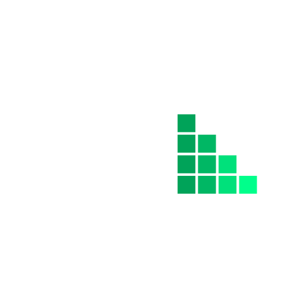

# 🎯 Habit Tracker

A modern, intuitive habit tracking application built with React Native and Expo. Track your daily habits, monitor progress, and build lasting positive routines with a clean, user-friendly interface.



## ✨ Features

### Core Functionality

- **Habit Creation & Management**: Create, edit, and delete custom habits with personalized settings
- **Progress Tracking**: Mark habits as complete and track your daily progress
- **Streak Monitoring**: Visualize your consistency with streak counters and progress circles
- **Weekly Scheduling**: Set specific days for each habit with flexible scheduling
- **Category Organization**: Organize habits by categories for better management

### User Experience

- **Authentication**: Secure user registration and login system
- **Cross-Platform**: Works seamlessly on iOS, Android, and web
- **Dark/Light Theme**: Automatic theme switching based on system preferences
- **Real-time Statistics**: View completion rates, streaks, and progress analytics
- **Offline Support**: Basic functionality works without internet connection

## 🛠️ Technology Stack

- **Framework**: React Native with Expo
- **Navigation**: Expo Router for file-based routing
- **Backend**: Firebase (Firestore & Authentication)
- **UI Components**: Custom components with React Native Paper integration
- **State Management**: React hooks and context
- **Date Management**: Day.js for date operations
- **Charts & Visualization**: React Native Chart Kit, SVG, and Progress components
- **TypeScript**: Full TypeScript support for type safety

## 📋 Prerequisites

Before running this project, make sure you have:

- Node.js (v16 or later)
- npm or yarn
- Expo CLI (`npm install -g @expo/cli`)
- Firebase project setup
- iOS Simulator (for iOS development) or Android Emulator (for Android development)

## 🚀 Installation & Setup

1. **Clone the repository**

   ```bash
   git clone [your-repo-url]
   cd habit-tracker
   ```

2. **Install dependencies**

   ```bash
   npm install
   ```

3. **Firebase Configuration**

   - Create a Firebase project at [Firebase Console](https://console.firebase.google.com/)
   - Enable Authentication and Firestore Database
   - Create a `.env` file in the root directory:

   ```env
   EXPO_PUBLIC_FIREBASE_API_KEY=your_api_key
   EXPO_PUBLIC_FIREBASE_AUTH_DOMAIN=your_auth_domain
   EXPO_PUBLIC_FIREBASE_PROJECT_ID=your_project_id
   EXPO_PUBLIC_FIREBASE_STORAGE_BUCKET=your_storage_bucket
   EXPO_PUBLIC_FIREBASE_MESSAGING_SENDER_ID=your_messaging_sender_id
   EXPO_PUBLIC_FIREBASE_APP_ID=your_app_id
   ```

4. **Start the development server**

   ```bash
   npm start
   ```

5. **Run on your preferred platform**
   - iOS: `npm run ios`
   - Android: `npm run android`
   - Web: `npm run web`

## 📱 Usage

### Getting Started

1. **Register/Login**: Create an account or sign in with existing credentials
2. **Create Your First Habit**: Tap the "+" button to add a new habit
3. **Set Schedule**: Choose which days of the week to track this habit
4. **Track Progress**: Mark habits as complete each day
5. **View Statistics**: Check your progress and streaks in the Statistics tab

### Habit Management

- **Create**: Add new habits with custom names, categories, and schedules
- **Edit**: Modify existing habits by tapping the edit button
- **Complete**: Mark habits as done for the day with a simple tap
- **Delete**: Remove habits you no longer want to track

### Statistics & Analytics

- **Completion Rates**: View weekly and all-time completion percentages
- **Streak Tracking**: Monitor your longest current streaks
- **Category Breakdown**: See habit distribution across categories
- **Progress Visualization**: Circular progress indicators for easy understanding

## 🏗️ Project Structure

```
├── app/                    # App screens and navigation
│   ├── (tabs)/            # Tab-based navigation screens
│   ├── auth/              # Authentication screens
│   └── modals/            # Modal screens (create/edit habits)
├── components/            # Reusable UI components
├── services/              # Firebase and external services
│   ├── firestore/        # Database operations
│   └── auth-provider.tsx # Authentication context
├── hooks/                 # Custom React hooks
├── utils/                 # Utility functions
├── constants/             # App constants and themes
└── assets/               # Images, fonts, and static assets
```

## 🎨 Design Philosophy

The app follows modern mobile design principles:

- **Minimalist Interface**: Clean, distraction-free design
- **Intuitive Navigation**: Easy-to-understand user flow
- **Consistent Theming**: Cohesive color scheme and typography
- **Responsive Layout**: Adaptable to different screen sizes
- **Accessibility**: Designed with accessibility best practices

## 🚧 Development

### Available Scripts

- `npm start`: Start the Expo development server
- `npm run ios`: Run on iOS simulator
- `npm run android`: Run on Android emulator
- `npm run web`: Run in web browser
- `npm test`: Run test suite

### Key Components

- **HabitCard**: Individual habit display and interaction
- **CompletionCircle**: Visual progress representation
- **StreakCircle**: Streak counter visualization
- **WeekDaySelector**: Day selection for habit scheduling

### Database Schema

The app uses Firestore with the following collections:

- `users`: User profiles and settings
- `habits`: Individual habit documents with completion tracking

## 🔮 Future Enhancements

- [ ] Habit templates and suggestions
- [ ] Advanced analytics and insights
- [ ] Social features and habit sharing
- [ ] Custom notifications and reminders
- [ ] Data export functionality
- [ ] Goal setting and milestones
- [ ] Habit categories customization
